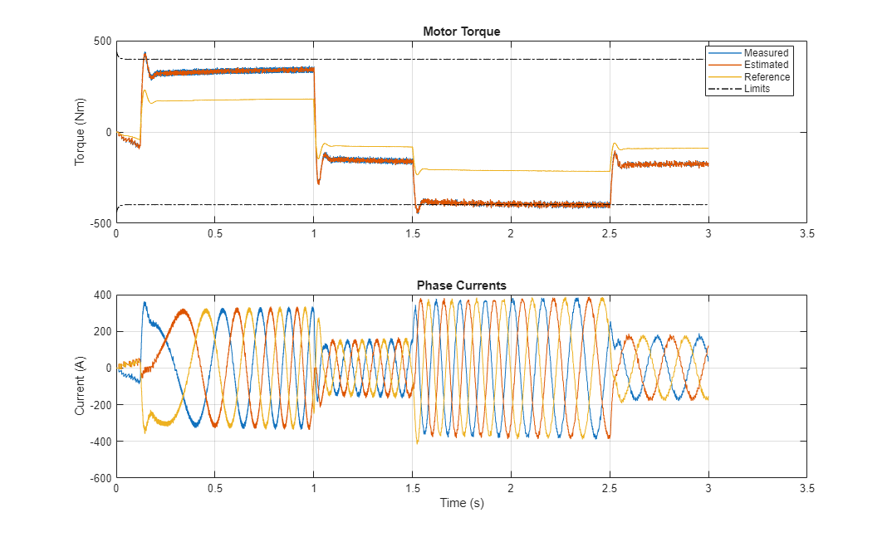

# **Hybrid-Electric Vehicle Model in Simulink**

This example shows a simplified series-parallel hybrid electric vehicle (HEV). An interior 
permanent magnet synchronous machine (IPMSM) and an internal combustion engine (ICE) provide 
the vehicle propulsion. The ICE also uses electric generator to recharge the high-voltage battery
during driving. The vehicle transmission and differential are implemented using a fixed-ratio 
gear-reduction model. The Vehicle Controller subsystem converts the driver inputs 
into torque commands. The vehicle control strategy is implemented as a Stateflow(R) state machine. 

The electrical system can be configured for a system-level analysis, using abstract motor models
that do not include power electronic switching.  Complete drive cycles can be run in seconds.
A more detailed variant includes the three electrical phases and the inverter.  This captures 
far more detail in the electrical system.

Copyright 2011-2025 The MathWorks(TM), Inc.

View on File Exchange:   
You can also open in MATLAB Online: 

## Setup 
To start this demonstration, open project HEV_SeriesParallel.prj

## **Model - Overview**

## **Model - Electrical System**

## **Model - Vehicle**

## **Simulation Results - System Level**

## **Simulation Results - Detailed**

To learn more about modeling and simulation with Simscape, please visit:
* [Simscape Getting Started Resources](https://www.mathworks.com/solutions/physical-modeling/resources.html)
* Product Capabilities:
   * [Simscape&trade;](https://www.mathworks.com/products/simscape.html)
   * [Simscape Battery&trade;](https://www.mathworks.com/products/simscape-battery.html)
   * [Simscape Driveline&trade;](https://www.mathworks.com/products/simscape-driveline.html)
   * [Simscape Electrical&trade;](https://www.mathworks.com/products/simscape-electrical.html)
   * [Simscape Fluids&trade;](https://www.mathworks.com/products/simscape-fluids.html)
   * [Simscape Multibody&trade;](https://www.mathworks.com/products/simscape-multibody.html)

## License
The license is available in the LICENSE.md file in this GitHub repository.

## Community Support
[MATLAB Central](https://www.mathworks.com/matlabcentral)

Copyright 2025 The MathWorks, Inc.
